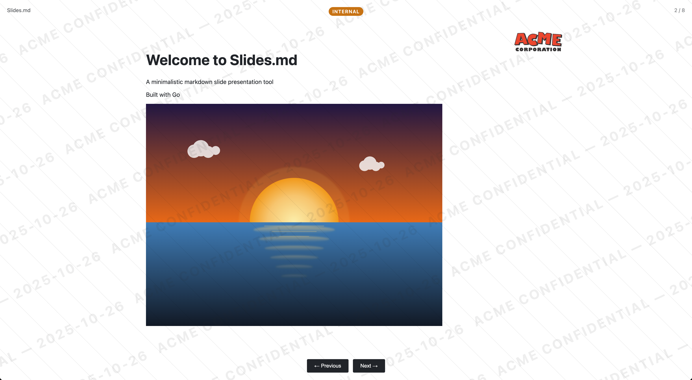

# Slides.md

A minimalistic markdown slide presentation tool written in Go. Serve any markdown file as beautiful, themeable slides in your browser.

## Features

- 🎨 **Multiple IDE-inspired themes**: Light, Dark, Solarized, Dracula, Nord, One Dark
- 📝 **Full markdown support**: Headings, code blocks, lists, links, and more
- ⌨️ **Keyboard navigation**: Arrow keys and spacebar
- 🎯 **Minimalistic design**: Clean, distraction-free interface
- ⚙️ **Configurable**: YAML-based theme configuration
- 🚀 **Fast**: Lightweight Go binary



## Installation

```bash
# Clone the repository
git clone https://github.com/LGDan/slides.md.git
cd slides.md

# Download dependencies
go mod download

# Build
go build -o slides main.go
```

## Usage

### Basic Usage

```bash
# Serve slides.md with default dark theme
./slides

# Specify a different markdown file
./slides -file=my-slides.md

# Use a different theme
./slides -theme=solarized-light

# Custom port
./slides -port=3000
```

### Command Line Options

- `-file`: Path to markdown file (default: `slides.md`)
- `-theme`: Theme name (default: `dark`)
- `-port`: Server port (default: `8080`)
- `-config`: Path to themes configuration file (default: `themes.yaml`)

### Available Themes

- `light` - Bright, clean GitHub-style theme
- `dark` - Dark mode with subtle colors (default)
- `solarized-light` - Solarized light theme
- `solarized-dark` - Solarized dark theme
- `dracula` - Dracula theme
- `nord` - Nord theme
- `one-dark` - One Dark Pro theme

## Creating Slides

Slides are automatically detected in your markdown file using:

1. **Horizontal rules**: Use `---` to separate slides
2. **Headings**: Each `#` heading starts a new slide

### Example

```markdown
# Welcome to Slides.md

A minimalistic presentation tool

---

## Getting Started

Run with:
\`\`\`bash
./slides -file=example.md
\`\`\`

---

## Features

- Markdown support
- Multiple themes
- Keyboard navigation
```

## Customizing Themes

Themes are defined in `themes.yaml`. To create a custom theme:

```yaml
themes:
  my-theme:
    name: My Theme
    title: Slides
    css: |
      body {
        background: #your-color;
        color: #your-text-color;
      }
      .slide {
        background: #your-color;
        color: #your-text-color;
      }
      button {
        background: #your-button-bg;
        color: #your-button-text;
      }
      # ... more CSS
```

### Theme options

Each theme supports the following optional fields in addition to `name`, `title`, and `css`:

- **logo**: Path or URL to a logo shown at the top-right of the slides.
  - Relative paths are resolved relative to your markdown file and served under `/assets/`.
  - Example: `logo: acme-corp.webp`

- **transition**: Slide transition style. One of `cut` (default), `fade`, `slide`.
  - Example: `transition: fade`

- **classification_label**, **classification_bg**, **classification_fg**: Show a classification pill centered at the top.
  - Example:
    ```yaml
    classification_label: INTERNAL
    classification_bg: "#d97706"
    classification_fg: "#ffffff"
    ```

- **first_slide**, **last_slide**: Prepend/append markdown slides.
  - Use `\n` for newlines inside YAML strings.
  - Example:
    ```yaml
    first_slide: "# Welcome to the Deck\nAcme Corp — Q4 Update"
    last_slide: "## Thanks!\nQuestions?"
    ```

- **watermark**: Overlay a page-wide diagonal text watermark.
  - Related options:
    - `watermark_text`: String to display. Defaults to the deck title.
    - `watermark_opacity`: 0–1 opacity (default: 0.08).
    - `watermark_append_date`: true/false to append current date (YYYY-MM-DD).
    - `watermark_move_seconds`: Integer seconds; if > 0, watermark drifts periodically.
  - Example:
    ```yaml
    watermark: true
    watermark_text: "ACME CONFIDENTIAL"
    watermark_opacity: 0.08
    watermark_append_date: true
    watermark_move_seconds: 10
    ```

### Config discovery

Config resolution order:

1. Path passed via `-config`
2. `$XDG_CONFIG_HOME/slides.md.yaml`
3. `~/.config/slides.md.yaml`
4. `./slides.md.yaml`
5. `./themes.yaml`

## Navigation

- **Right Arrow** or **Space**: Next slide
- **Left Arrow**: Previous slide
- **Click buttons**: Navigate manually

## Example

Try running with the included example:

```bash
./slides -file=example-slides.md -theme=dracula
```

Then open http://localhost:8080 in your browser.

## License

MIT